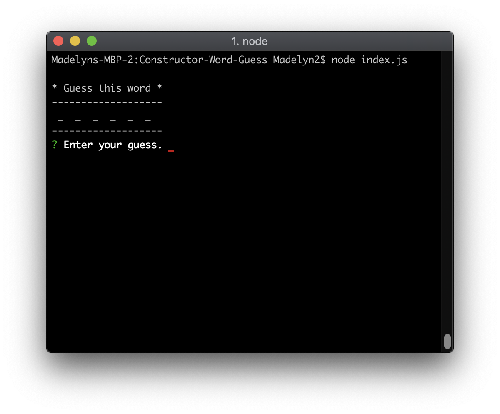
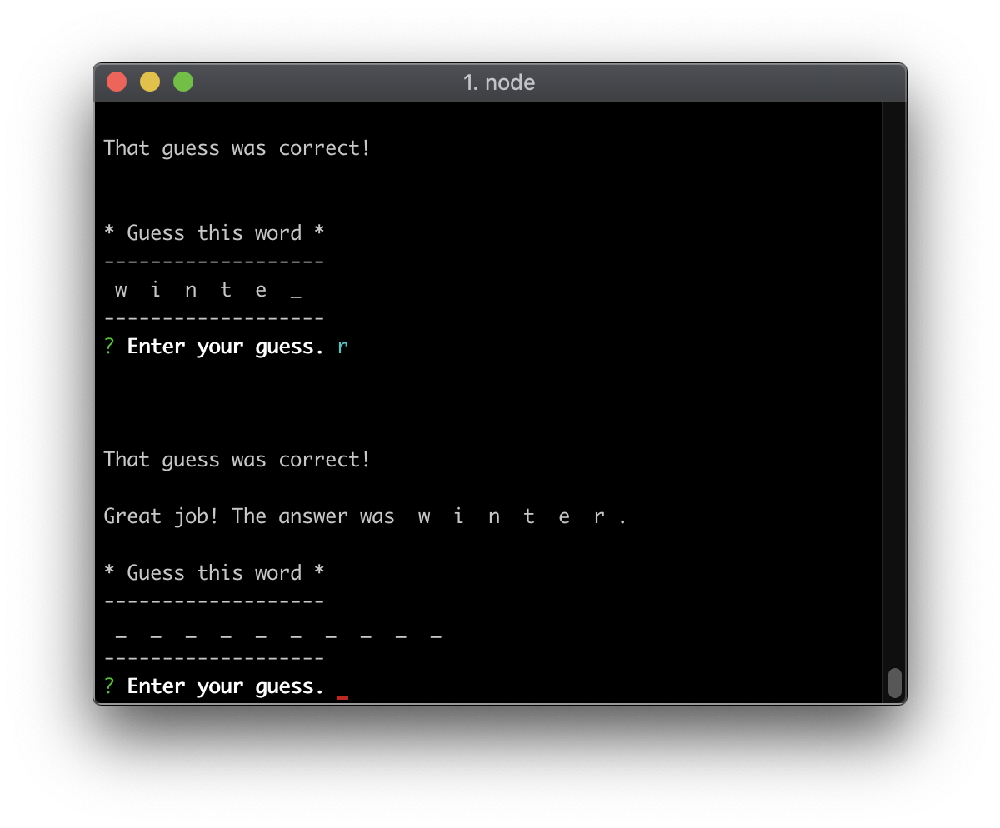
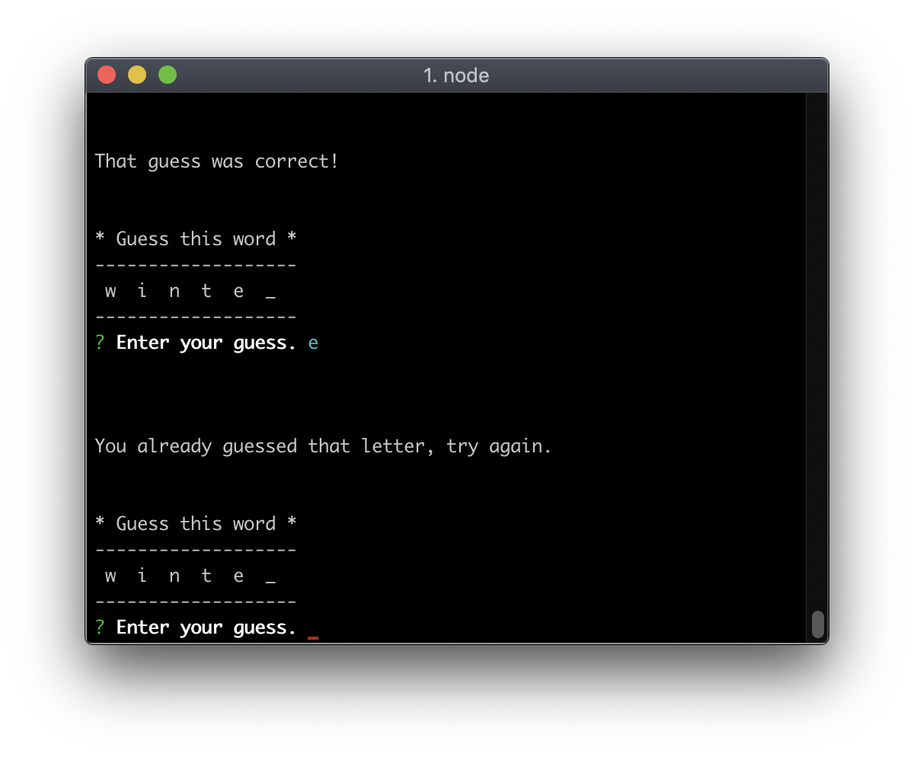
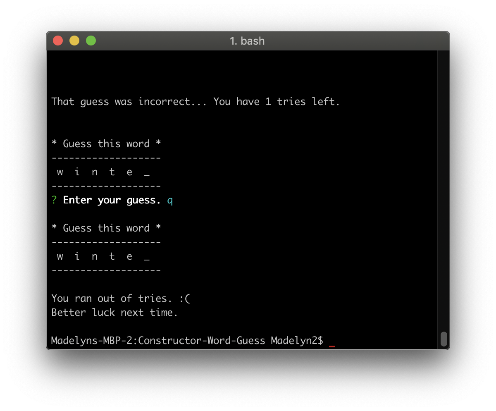
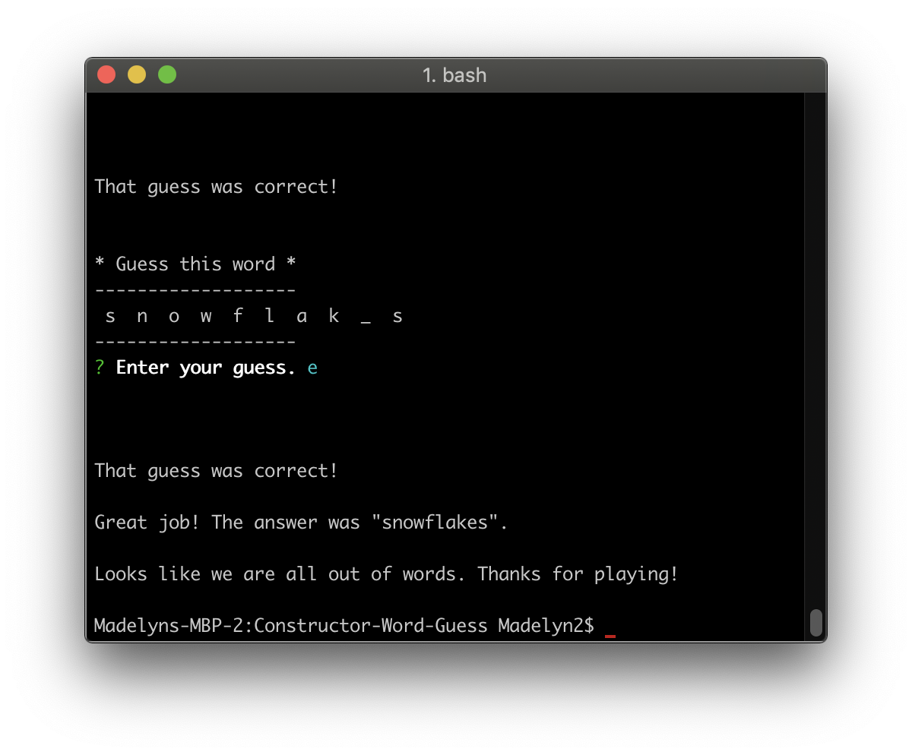

<h1>Constructor Word Guess</h1>

### Table of Contents 
- [What does it do?](#what-does-it-do)
- [Technologies](#technologies)
- [Contributor](#contributor)

 

## What does it do?

 * The application is run on the computer's command line interface. 
 * It is a game where the user has to guess what a given word is letter by letter.
 

 * If the user's guess was correct and they finished guessing the first word a new word is given.

 

 * If the user guesses a letter twice they are prompted to guess again.

  

* If the user's guess was incorrect more than 6 times for one word the game is over.

 

 * If the user has guessed all words given correctly the game ends.

  

## Technologies Used

- JavaScript
- Node.js
- NPM Inquirer

## Contributor

Made by Madelyn Helton. 2018.